# ODDK CKAN Admin Portal User Guide

- [Introduction to the CKAN Admin Portal](#introduction-to-the-ckan-admin-portal)
- [Getting Started: Authentication](#getting-started-authentication)
    - [Logging In](#logging-in)
    - [Creating an Account](#creating-an-account)
    - [Reset your Password](#reset-your-password)
- [Dataset Management](#dataset-management)
    - [Creating a Dataset](#creating-a-dataset)
    - [Editing and Deleting a Dataset](#editing-and-deleting-a-dataset)
- [Organization Management](#organization-management)
    - [Creating an Organization](#creating-an-organization)
    - [Managing Organization Members](#managing-organization-members)
- [Group Management](#group-management)
- [Administration Functionality](#administration-functionality)
    - [Sysadmin Management](#sysadmin-management)
    - [Portal Configuration](#portal-configuration)
    - [Waste/Trash](#wastetrash)
    - [Create an Account](#create-an-account)
- [Additional Resources](#additional-resources)

## Introduction to the CKAN Admin Portal

The ODDK CKAN Admin portal is the non-public home of datasets, organizations, groups, and users. All CKAN data management is done within this portal:
[https://admin.opendata.dk](https://admin.opendata.dk)

The public frontend retrieves CKAN data from the portal above and displays it as needed:
[https://www.opendata.dk](https://www.opendata.dk)

## Getting Started: Authentication

**Note:** The portal uses [ckanext-noanonaccess](https://github.com/datopian/ckanext-noanonaccess), which prevents unauthorized users from accessing pages that are public by default (e.g., the home page, /dataset, /organization, etc.). Unauthorized users get redirected to the login page. Pages/paths can be allowed via this configuration option:

```
ckanext.noanonaccess.allowed_paths = /about/.* /oauth2/callback
```

### Logging In

- Navigate to the portal's login page at [https://admin.opendata.dk/user/login](https://admin.opendata.dk/user/login):

  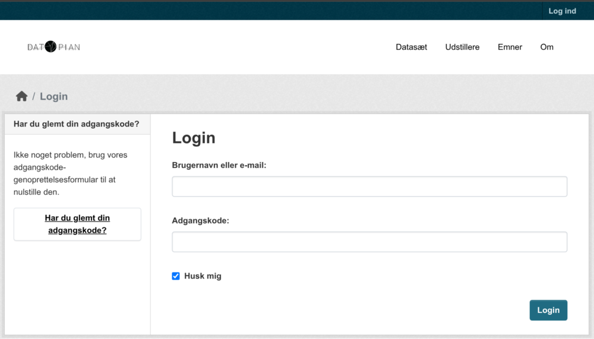

- Enter your username and password in the provided fields.
- Click the **Login** button.

### Creating an Account

If you do not have an account, contact a site administrator. User registration is currently only available for authenticated users with the proper permissions.

### Reset your Password

If you forget your password, click "**Forgot your password?**" on the login page:

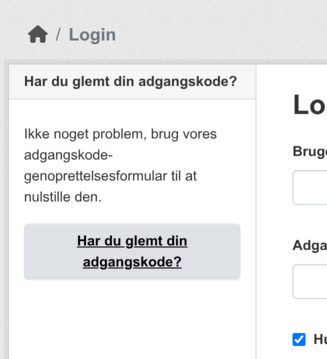

Then enter your username or email address and click "**Request Reset**".

## Dataset Management

### Creating a Dataset

- Navigate to the Dataset Creation Page:
  - Once logged in, click on "**Datasets**" in the navigation bar:

    

  - Click the "**Add Dataset**" button:

    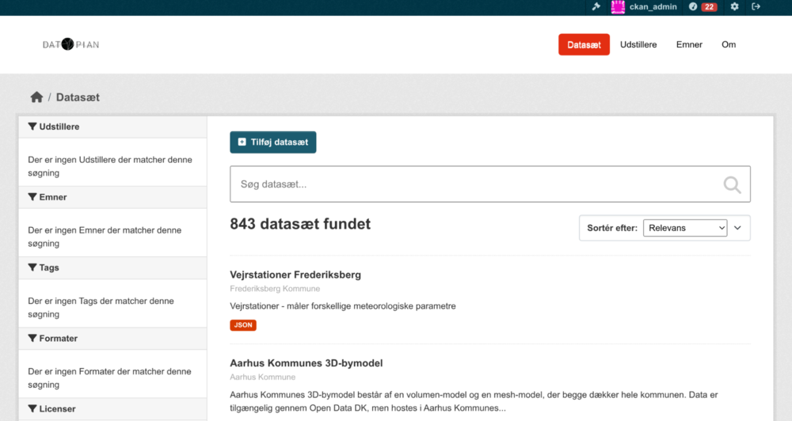

- Enter Dataset Information

  - Enter the relevant metadata:

    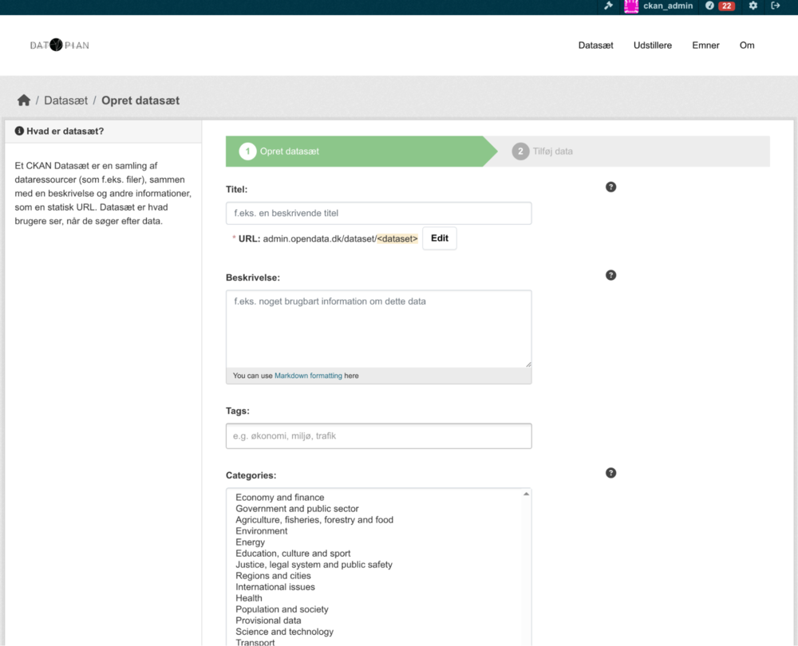

  - "**Title**", "**Data Owner**", and "**Data Owner email**" are always required. You cannot save a dataset without these fields, and the portal will prevent you from proceeding without values:

    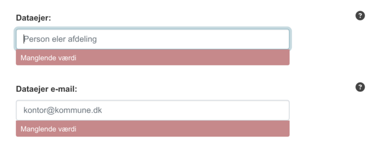

  - "**Data Directory"** (Datavejviser DCAT) field help text can be displayed by hovering over the “?” icons (it will indicate whether the fields are required or optional for valid DCAT output).


    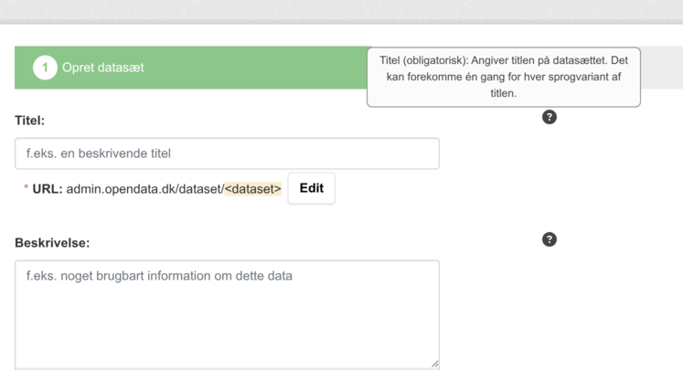

  - If you want a dataset to appear in the Data Directory, you must add at least the required fields, and then check the box at the bottom of the dataset form:

    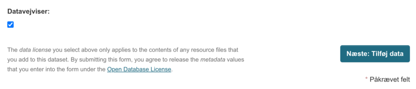

  - Then click **Next: Add data**.

- Upload Resources

  - You can either upload or link to a resource file (e.g., CSV, JSON, PDF, URLs, etc.):

    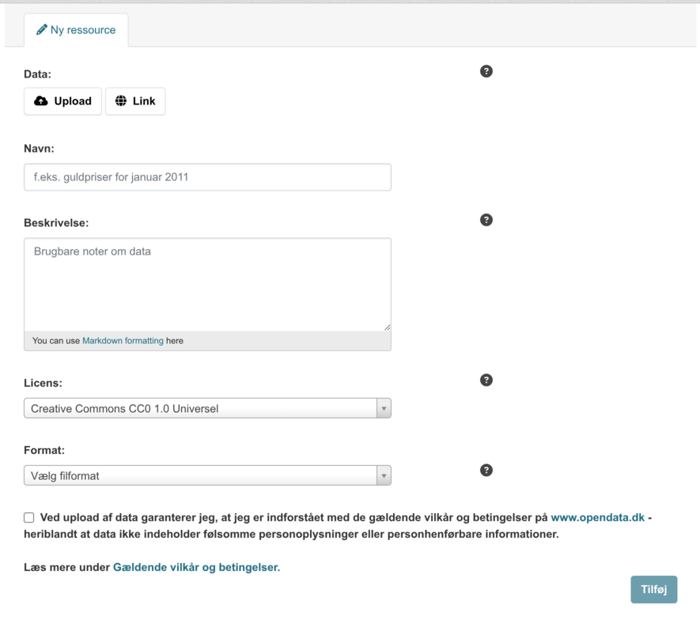

  - Resources also have Data Directory (Datavejviser DCAT) field help text that can be displayed by hovering over the “?” icons:

    

  - Once you upload/link your resource and add the relevant metadata, you’ll need to agree to the terms and conditions before proceeding:

    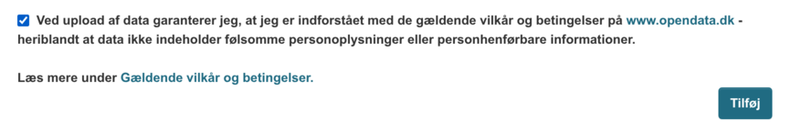

  - You can click "**Previous**" to go back to the dataset metadata form, "**Save and add one more**" to add another resource, or "**Exit**" to finalize and save the dataset.

### Editing and Deleting a Dataset

- Editing:

  - Navigate to the dataset you wish to edit (click on the dataset on `/dataset`, or visit `/dataset/<DATASET_NAME>`).
  - Click the "**Manage**" button (top right corner):

    
    

  - After making your changes, scroll to the bottom of the page and click "**Update Dataset**".

- Deleting

  - On the same page as above, you'll find the "**Delete**" button next to "**Update Dataset**":

    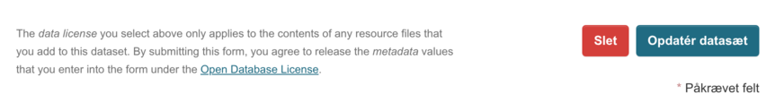

  - To delete the dataset, click **Delete**. This will open a confirmation popup to ensure it wasn’t clicked by mistake. 

    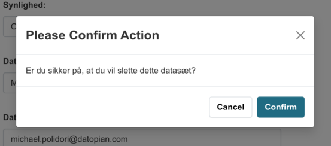

  - If you want to proceed with deletion, click "**Confirm**" to proceed, or "**Cancel**" to back out.

## Organization Management

**Note:** Datasets can be added to organizations from the dataset metadata form page seen in the previous section.

### Creating an Organization

- Navigate to Organizations:

  - Click on **Organizations** in the navigation bar:

    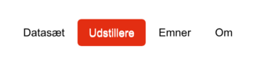

  - Click **Add organization**:

    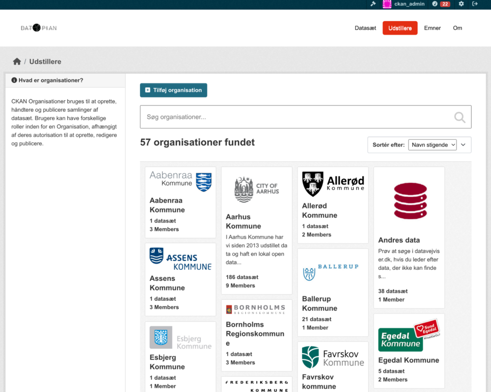

  - Enter organization details:

    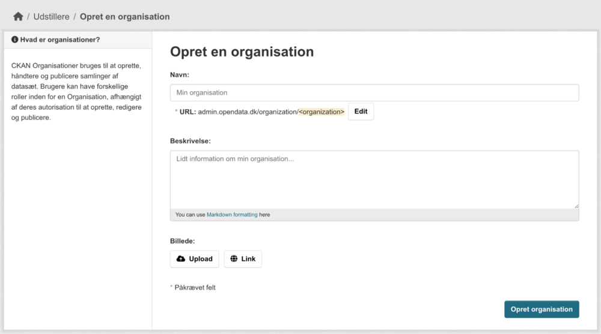

  - Click **Create organization**.

### Managing Organization Members

As an organization administrator, you can add or remove members and assign roles (Member, Editor, or Admin) within the organization's management page. You can also invite new users to the portal and organization via email on the same page.

- Navigate to the Organization you want to manage (click on the organization on the top navigation menu, or visit the URL directly, `/organization/<ORGANIZATION_NAME>`):

   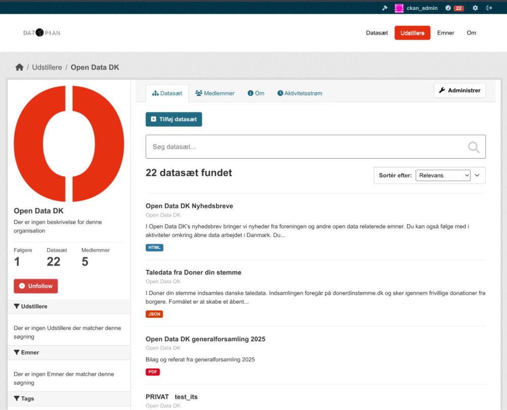

- Click on "**Manage**", then click on "**Members**":

   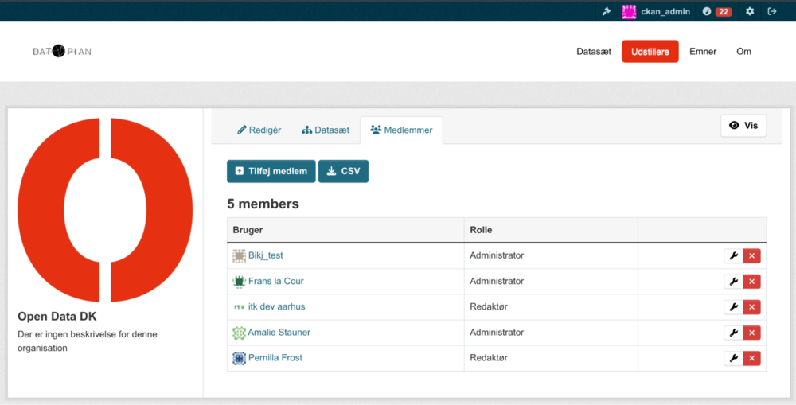

- Click "**Add member**" to add a new member:

   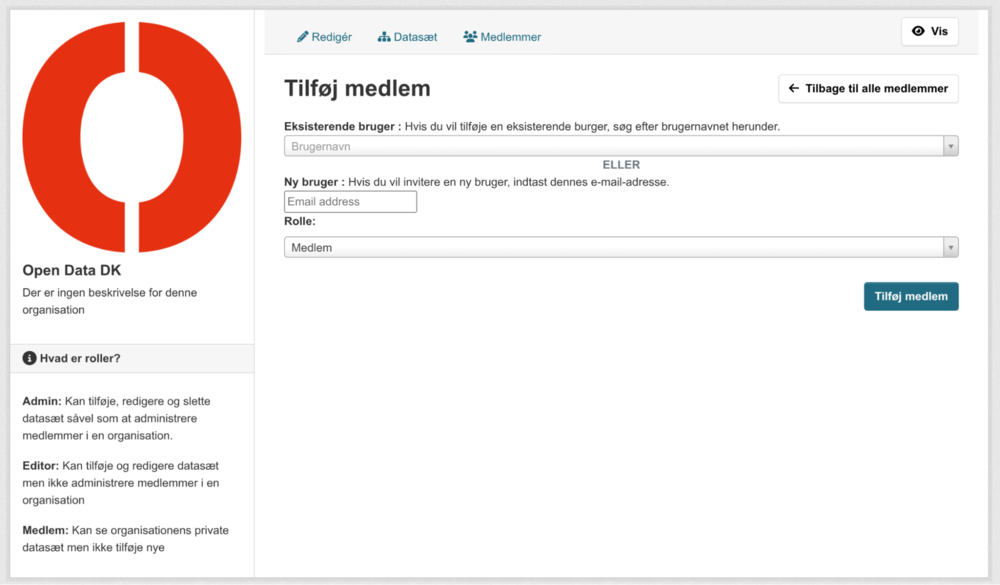

- Click "**Add member**" again to save.

- To edit an existing user, click the wrench icon; to remove, click **X** (this removes them from the organization, not the portal):

   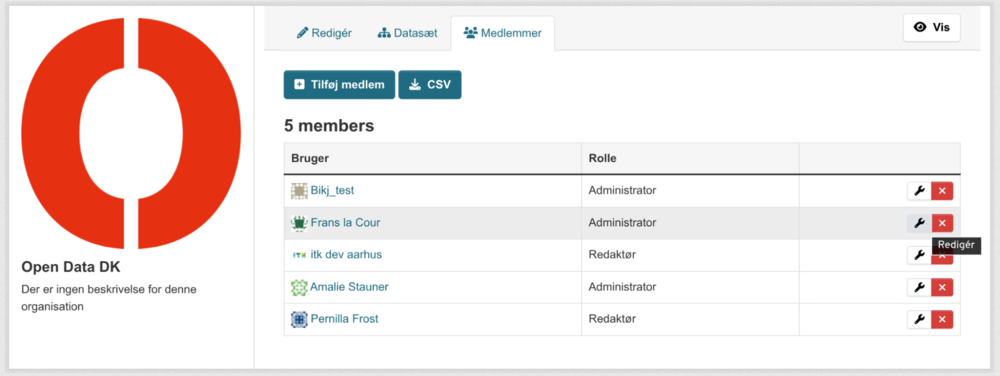

Organizations have the following roles:

**Admin**: _Can add, edit, and delete datasets as well as manage members in an organization._  
**Editor**: _Can add and edit datasets, but cannot manage members in an organization._  
**Member**: _Can view the organization's private datasets but cannot add new ones._  

## Group Management

The process for groups (Topics) is the same as organizations, aside from a few differences:

- Groups only have **Member** and **Admin** roles.
- To add a dataset to a group, navigate to the dataset, click "**Topics**", select a group, and click "**Add to group**":

  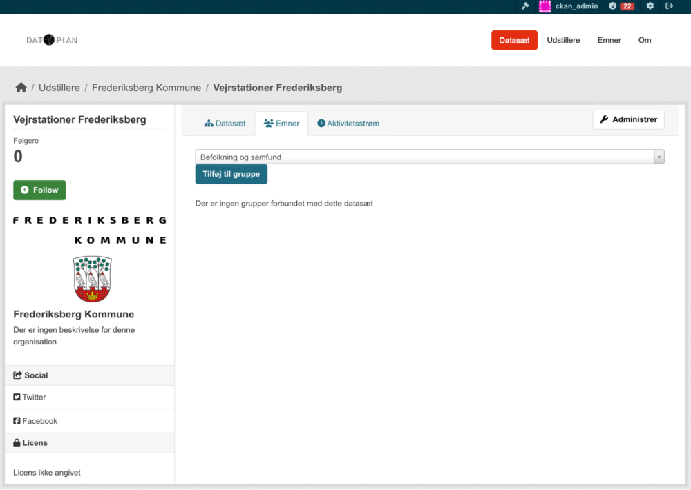

- Datasets can be added to multiple groups, but only one organization.

## Administration Functionality

Portal administrators have additional privileges to manage users and overall portal settings.

- To see these settings, click on the hammer icon (the first icon in the top menu):

  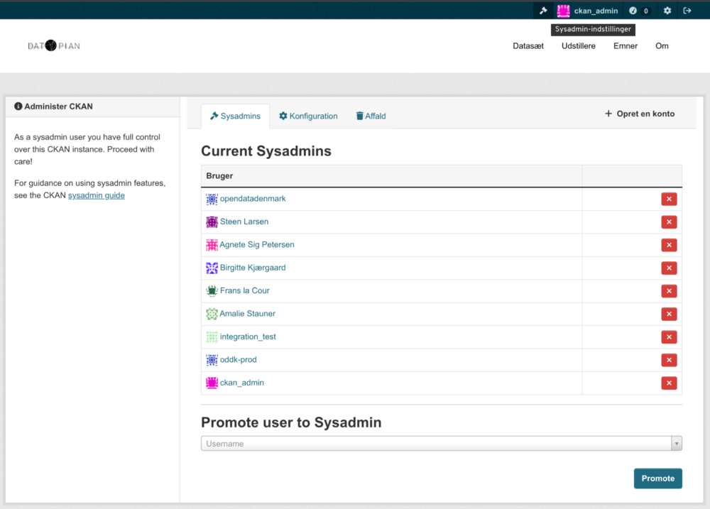

### Sysadmin Management

- On the "**Sysadmins**" tab (`/ckan-admin`), you can give a user sysadmin privileges by selecting their name from the dropdown:

  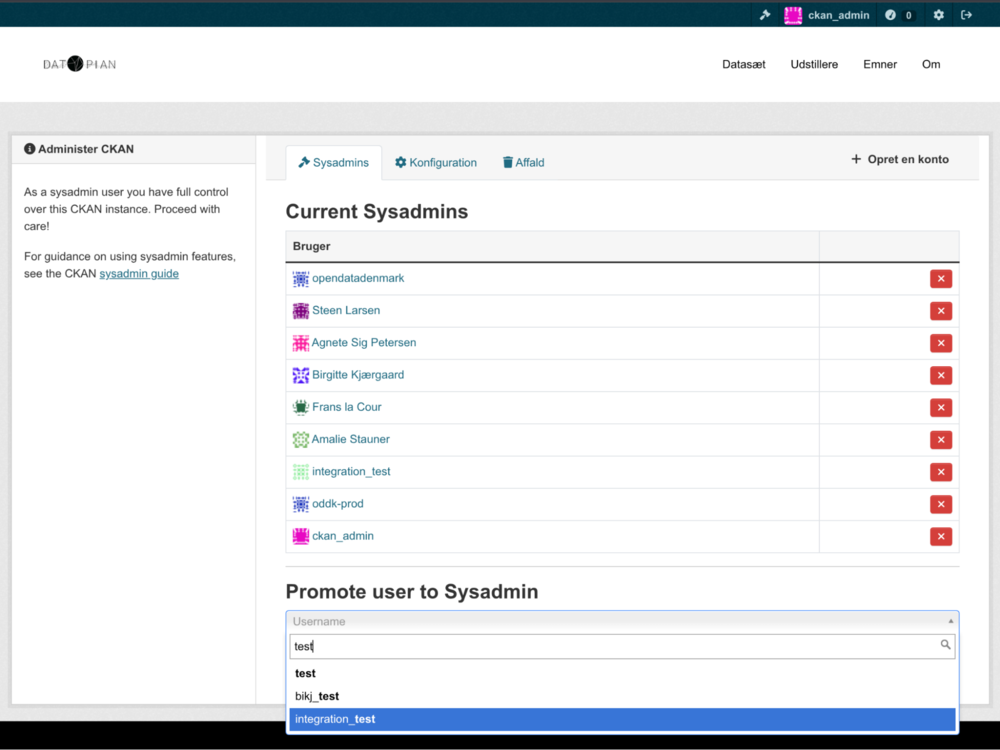

- Then click "**Promote**".

### Portal Configuration

- Global configuration settings are under the "**Configuration**" tab (`/ckan-admin/config`):

  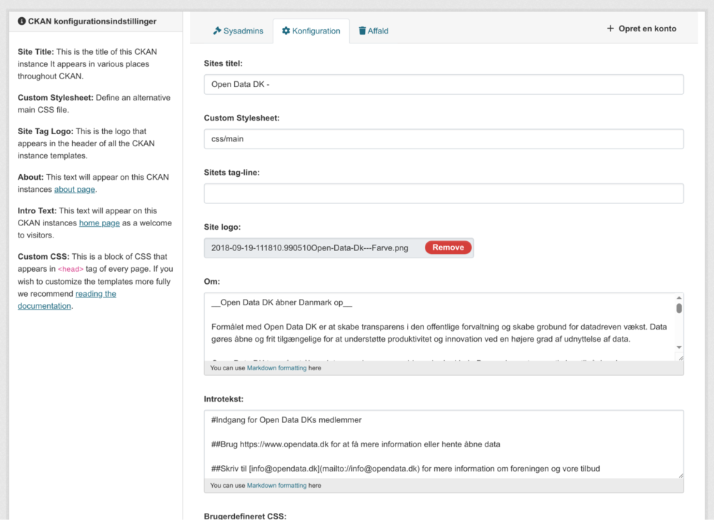

- Make desired changes and click "**Update configuration**", or click "**Reset**" to restore defaults.

  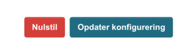

### Waste/Trash

- When you delete a dataset, organization, or group in CKAN, they don't get removed from the DB by default. Instead, they're marked as "deleted" in their metadata and are hidden from the UI. These deleted items can be found on the last tab, "**Waste**":

  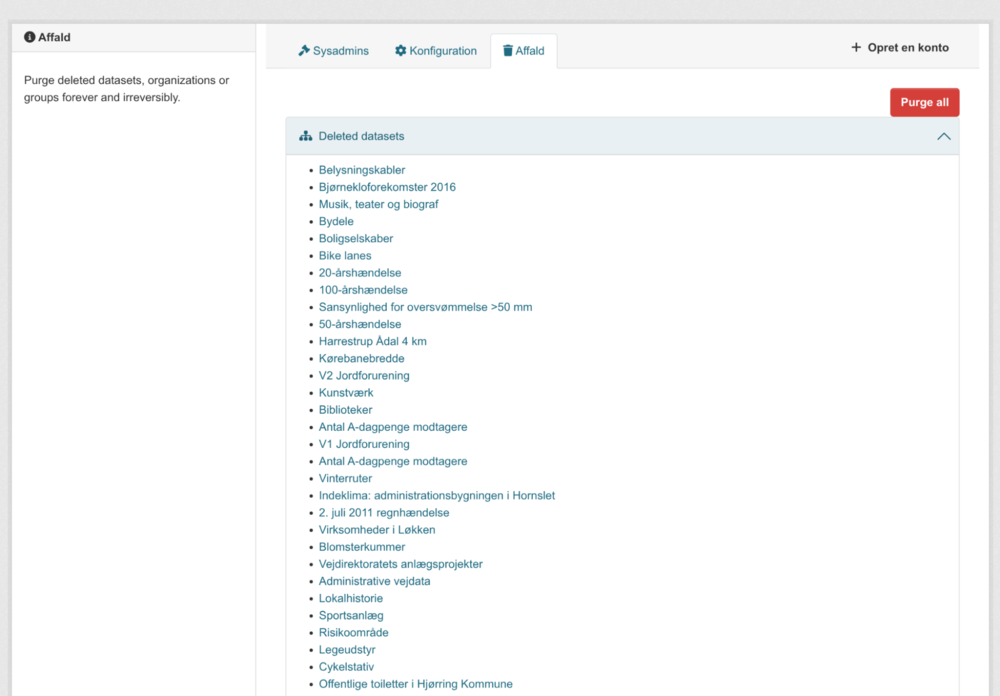

- You can remove them all with the bulk "**Purge all**" button.
- _Or_, you can remove only the datasets, organizations, or groups (**note**: you can't purge individual datasets, organizations, or groups via UI—e.g., clicking on "**Purge**" on the page in the screenshot below will permanently remove those listed groups together):

  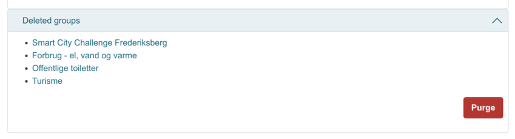

### Create an Account

- On the right side of the tab navigation, click "**Create an account**":

  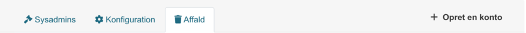

- Enter user details and click "**Create account**":

  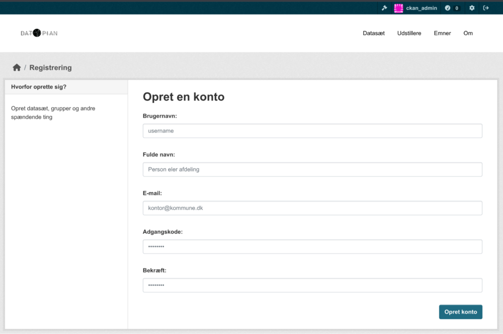

## Additional Resources

- [CKAN documentation](https://docs.ckan.org/en/2.11/contents.html)
- [CKAN repository](https://github.com/ckan/ckan)
